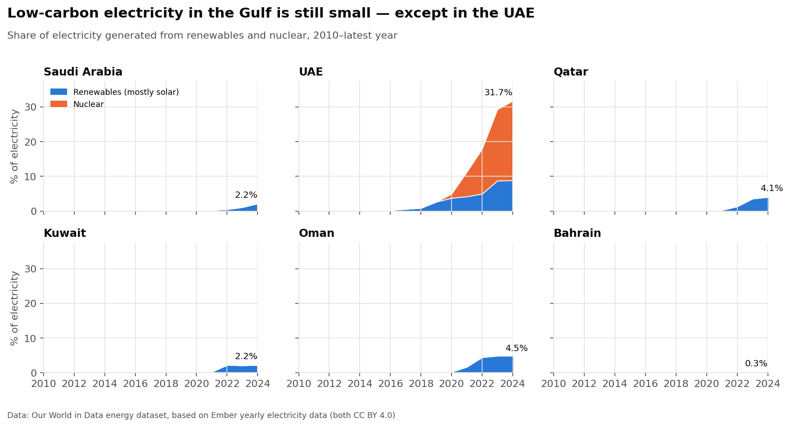
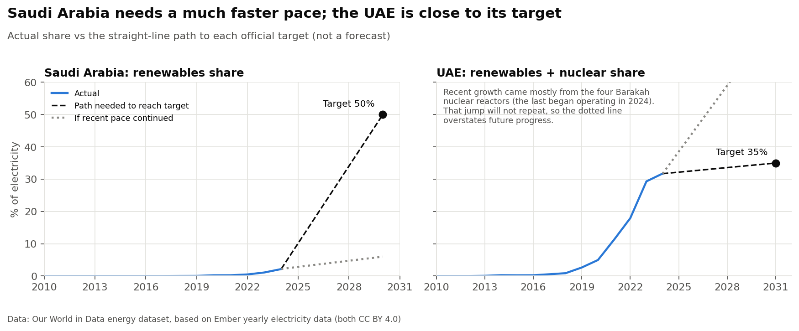

# Gulf Electricity Transition Tracker

How quickly are the six Gulf (GCC) countries moving from gas and oil to low-carbon electricity, and are Saudi Arabia and the UAE moving fast enough to meet their own official targets?

This is a small, reproducible data-analysis project using open data. It downloads the data, cleans it, checks it for problems, compares countries and draws five charts. You can run all of it with one command.



## Questions

1. What share of each GCC country's electricity comes from low-carbon sources (renewables and nuclear), and how has that changed since 2010?
2. How much electricity does each country generate per person, compared with the world average?
3. Has the carbon intensity of electricity (CO₂-equivalent per kWh) fallen?
4. At its recent pace, is Saudi Arabia on track for its official renewables target? Is the UAE on track for its clean-energy target?

## Key findings

*Latest year with reliable data: 2024 or 2025 depending on the country. Full tables are in [`reports/findings.md`](reports/findings.md).*

| Country | Low-carbon share of electricity | kWh per person | Change in CO₂ per kWh since 2010 |
|---|---|---|---|
| UAE | 31.7% (22.9% nuclear + 8.8% renewables) | 16,075 | −31% |
| Oman | 4.5% | 9,617 | −4% |
| Qatar | 4.1% | 18,030 | −4% |
| Saudi Arabia | 2.2% | 13,386 | no change |
| Kuwait | 2.2% | 18,744 | −3% |
| Bahrain | 0.3% | 23,615 | no change |

- **Five of six countries still generate more than 95% of their electricity from gas and oil.** The UAE is the exception, mainly because of the Barakah nuclear power plant (first electricity in 2020, fourth reactor in 2024).
- **Electricity generated per person is 2.5–6 times the world average** (world: ~3,860 kWh). Total generation also grew by 59–167% between 2010 and the latest year, so new clean electricity first has to keep up with that growth.
- **Saudi Arabia's official target is roughly 50% renewable electricity by 2030.** From 2.2% in 2024, that needs about **8 percentage points per year**. The average over 2021–2024 was about **0.6 points per year**. New power plants could change this pace quickly. This analysis only measures the past pace and does not predict the future.
- **The UAE targets 35% clean electricity generation by 2031** and was at 31.7% in 2024. It needs about 0.5 points per year. Most of its recent growth came from nuclear reactors that are now all running, so future growth has to come from solar.

<p float="left">
  
</p>

More charts: [ranking](reports/figures/02_latest_low_carbon_ranking.png) · [electricity per person](reports/figures/03_electricity_per_person.png) · [carbon intensity](reports/figures/04_carbon_intensity_change.png)

## Data

| | |
|---|---|
| **Dataset** | [Our World in Data — Energy dataset](https://github.com/owid/energy-data) |
| **Underlying source for electricity** | [Ember — Yearly Electricity Data](https://ember-energy.org/data/yearly-electricity-data/) |
| **Licence** | CC BY 4.0 (both OWID and Ember). Free to use with credit. |
| **Countries** | Saudi Arabia, UAE, Qatar, Kuwait, Oman, Bahrain (+ World for comparison) |
| **Years used** | 2010 to latest (2024/2025) |
| **Targets** | [Saudi Ministry of Energy](https://www.moenergy.gov.sa/en/eco-system/programs/renewable-energy) · [UAE Energy Strategy 2050](https://u.ae/en/about-the-uae/strategies-initiatives-and-awards/strategies-plans-and-visions/environment-and-energy/uae-energy-strategy-2050) |

The raw data file (~9 MB) is **not stored in this repository**. `src/download_data.py` downloads it. See [`data/README.md`](data/README.md) and [`docs/data_dictionary.md`](docs/data_dictionary.md).

## How to run

Requires Python 3.10 or newer.

```bash
git clone https://github.com/emanmusheer2008-glitch/gulf-electricity-transition.git
cd gulf-electricity-transition

python -m venv .venv
# Windows: .venv\Scripts\activate      macOS/Linux: source .venv/bin/activate
pip install -r requirements.txt

python run_all.py          # download → clean → analyse → charts
python -m pytest           # run the tests
```

Outputs: `reports/findings.md` (tables) and `reports/figures/*.png` (charts).
To explore step by step, open `notebooks/01_exploration.ipynb`.

## Project structure

```
gulf-electricity-transition/
├── run_all.py               # runs every step in order
├── src/
│   ├── config.py            # countries, years, targets, file paths
│   ├── download_data.py     # step 1: download raw CSV
│   ├── clean_data.py        # step 2: filter + flag suspicious rows
│   ├── analysis.py          # step 3: summary table + target check
│   └── make_figures.py      # step 4: charts
├── notebooks/01_exploration.ipynb   # data exploration
├── tests/test_analysis.py   # checks the calculations
├── data/                    # raw/ and processed/ (not committed)
├── reports/                 # findings.md + figures/
└── docs/data_dictionary.md  # what each column means
```

## Method

1. **Filter:** keep the 6 GCC countries plus the World, years 2010 onwards and 13 of the ~130 columns.
2. **Quality check:** flag rows where the main values are *exactly* the same as the previous year. One row, Kuwait 2025, matched 2024 exactly. This is a **potential data-quality anomaly, detected and flagged for review**. The source does not say why the values repeat, so the row is left out of the analysis rather than treated as a confirmed error.
3. **Describe:** compare the first year (2010) with the latest year for each country.
4. **Target check:** `required pace = (target − current) ÷ years left` and `recent pace = change over the last 3 years ÷ 3`.

**Why no machine learning?** The questions are descriptive: what happened, and how does it compare with a target. There are only about 15 yearly data points per country, and the future depends on policy decisions and construction projects that are not in the data. A predictive model would look impressive but would not be trustworthy, so simple arithmetic is the honest choice here.

## Limitations

- **Definitions differ.** The UAE target counts "clean energy", which may be defined differently from OWID's "renewables + nuclear". Saudi Arabia's target is described as *around* 50% of the electricity mix. Treat the target check as approximate.
- **Recent pace is not a forecast.** Energy capacity grows in large steps as big plants open, not smoothly.
- **Only two targets are checked.** Qatar, Oman, Kuwait and Bahrain have targets too, but they were not verified against an official source for this version, so they are not included.
- **Generation, not capacity.** Some targets are written in installed capacity (GW). This project uses generation (TWh), which is what the data provides.
- **Data revisions.** OWID and Ember update their data. Rerunning later may change the numbers slightly.

## Possible next steps

- Add the other GCC targets after checking each one against an official source.
- Add monthly data (Ember publishes monthly electricity data) to look at seasonal patterns such as summer peaks.
- Compare with installed solar capacity data (IRENA) to separate "capacity built" from "electricity produced".
- Build a small interactive dashboard (e.g. Streamlit) on top of the same cleaned data.

## Sources

- Our World in Data, *Energy dataset* (CC BY 4.0): https://github.com/owid/energy-data
- Ember, *Yearly Electricity Data* (CC BY 4.0): https://ember-energy.org/data/yearly-electricity-data/
- Saudi Ministry of Energy, *Renewable Energy* programme page: "renewables which are going to make up around 50% of the energy mix used to produce electricity by 2030": https://www.moenergy.gov.sa/en/eco-system/programs/renewable-energy
- UAE Government portal, *UAE Energy Strategy 2050*: "Increase the share of clean energy generation to 35% by 2031": https://u.ae/en/about-the-uae/strategies-initiatives-and-awards/strategies-plans-and-visions/environment-and-energy/uae-energy-strategy-2050
- NucNet, Barakah fourth reactor begins commercial operation (September 2024): https://www.nucnet.org/news/uae-hails-historic-milestone-as-fourth-and-final-reactor-begins-operation-9-4-2024

Targets and data were re-checked on 27 September 2026.

## Credits

Data: Our World in Data and Ember, both CC BY 4.0. Code: MIT licence (see `LICENSE`).
Built as a learning project. See [`LEARNING_GUIDE.md`](LEARNING_GUIDE.md) for a plain-English explanation of every part.
